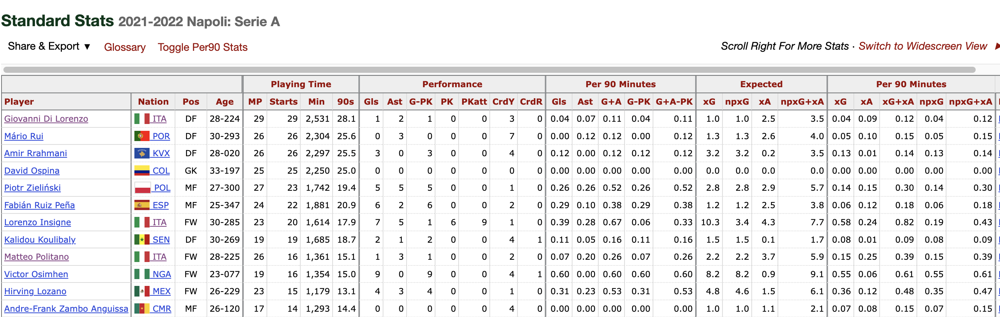
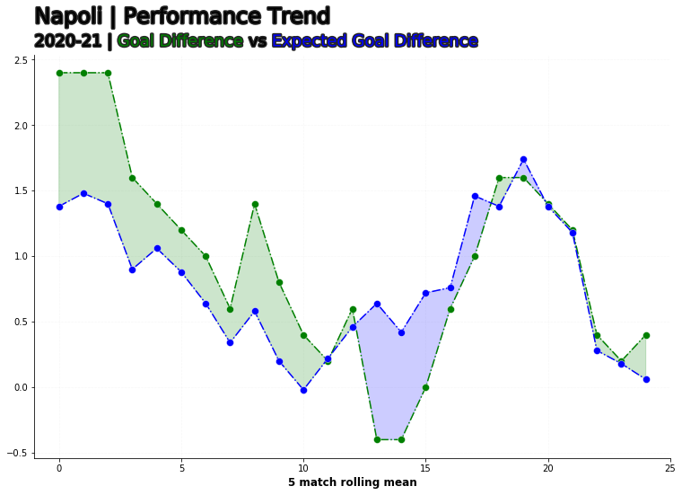

Code & notebook for this post can be found [here](https://github.com/steveaq/Webs-Scraping-for-Fooball-Data-/blob/main/FBREF%20League%20%26%20Team%20Data%20Exploration.ipynb). 

In my previous post, which you can find [here](), I outlined the current data landscape in the football analytics world and how one might go about aquiring those related metrics.


This post is a part of series of posts, where we will explore how to use web-scraping packages available in python to get football data as efficiently as possible.

This project is written in Python and my webscraper of choice is BeautifulSoup. I've had a little bit of exposure to this already and seems to be the most popular 'web-scraper'. so naturally as safe bet.

For the data source, I've gone with FBREF, very popular with the football hipsters and kids on twitter that comment 'ykb' under posts they agree with. 
The underlying data for FBREF is provided by StatsBomb, so A* for reliabilty and accuracy.
There is vast amount of this data available at league, team, player and match level, complete with deatiled metrics such as pass types and even body parts used for passes. The issue is being able to programtically sift through the webpages to get there. 

The end goal of this is to:

- Create a set of working functions to aggregate data from FBREF.

- Perform a series of data munging tasks to get easy to to use datasets ready for analysis.

- Create a series of Data Visualisations from these cleaned datasets.

- Assess the meaningful metrics we need to start making some predictions on player suitability to positions.


<!-- To prevent this sounding more like an absctract, let get into the fun stuff.  -->


## Setup

First we have to install Beautiful Soup. The beautiful soup package will find the tables we need in the source code of the html. The following [article]( https://smehta.medium.com/scrape-and-create-your-own-beautiful-dataset-from-sports-reference-com-using-beautifulsoup-python-c26d6920684e) goes in to great depths as to how the package works and how you can find the tables you need.

```python
pip install beautifulsoup4

Collecting beautifulsoup4
  Downloading beautifulsoup4-4.10.0-py3-none-any.whl (97 kB)
     |████████████████████████████████| 97 kB 13.1 MB/s            
Collecting soupsieve>1.2
  Downloading soupsieve-2.3.1-py3-none-any.whl (37 kB)
Installing collected packages: soupsieve, beautifulsoup4
Successfully installed beautifulsoup4-4.10.0 soupsieve-2.3.1
WARNING: You are using pip version 21.3.1; however, version 22.0.4 is available.
You should consider upgrading via the '/usr/local/bin/python3 -m pip install --upgrade pip' command.
Note: you may need to restart the kernel to use updated packages.
```


Next up, we import all our necessary packages for web-scraping, data cleaning and analysis.

```python
import os
import requests
import pandas as pd
from bs4 import BeautifulSoup
import seaborn as sb
import matplotlib.pyplot as plt
import matplotlib as mpl
import warnings
import numpy as np
from math import pi
from urllib.request import urlopen
import matplotlib.patheffects as pe
from highlight_text import fig_text
from adjustText import adjust_text
```


## Data 

Let's load the data. For the sake of ease lets start with a squad page. I've gone with this as this page seems to have the most data in a table that is easy for the scrapper to access and retrieve the infomation from. I'm watching far more Serie A these days so the team I've gone with is Napoli. The fbref page used can be found [here](https://fbref.com/en/squads/d48ad4ff/Napoli-Stats).  



 The first function requires the URL of squad to be passed, in order to return a pandas dataframe with the high level per/90 team stats available on this page.

```python
def generate_squadlist(url): 
    html = requests.get(url).text
    data = BeautifulSoup(html, 'html5')
    table = data.find('table')
    cols = []

    for header in table.find_all('th'):
        cols.append(header.string)

    columns = cols[8:37] #gets necessary column headers
    players = cols[37:-2]

    #display(columns)
    rows = [] #initliaze list to store all rows of data
    for rownum, row in enumerate(table.find_all('tr')): #find all rows in table
        if len(row.find_all('td')) > 0: 
            rowdata = [] #initiliaze list of row data
            for i in range(0,len(row.find_all('td'))): #get all column values for row
                rowdata.append(row.find_all('td')[i].text)
            rows.append(rowdata)
    df = pd.DataFrame(rows, columns=columns)

    df.drop(df.tail(2).index,inplace=True)
    df["Player"] = players
    df.drop('Matches', axis=1, inplace=True)
    df['Nation'] = df['Nation'].str[3:]
    # df["team"] = name
    df.set_index("Player")
```


The above functions works on any page with this template so effectly any teams stats page will work with this function. 

I want to be able to get the team name and store it for later. As it happens the URLs for FBREF follow a similar pattern so we can slice the list to get the name and save it in the team name variable.


```python
team = "https://fbref.com/en/squads/d48ad4ff/Napoli-Stats"
team_name = team[37:-6]
squad_stats_per_team = generate_squadlist(team)
squad_stats_per_team.head()
```

Now lets have a look a the output 

<table border="1" class="dataframe">
  <thead>
    <tr style="text-align: right;">
      <th></th>
      <th>Nation</th>
      <th>Pos</th>
      <th>Age</th>
      <th>MP</th>
      <th>Starts</th>
      <th>Min</th>
      <th>90s</th>
      <th>Gls</th>
      <th>Ast</th>
      <th>G-PK</th>
      <th>PK</th>
      <th>PKatt</th>
      <th>CrdY</th>
      <th>CrdR</th>
      <th>Gls</th>
      <th>Ast</th>
      <th>G+A</th>
      <th>G-PK</th>
      <th>G+A-PK</th>
      <th>xG</th>
      <th>npxG</th>
      <th>xA</th>
      <th>npxG+xA</th>
      <th>xG</th>
      <th>xA</th>
      <th>xG+xA</th>
      <th>npxG</th>
      <th>npxG+xA</th>
      <th>Player</th>
    </tr>
  </thead>
  <tbody>
    <tr>
      <th>0</th>
      <td>ITA</td>
      <td>DF</td>
      <td>28-224</td>
      <td>29</td>
      <td>29</td>
      <td>2,531</td>
      <td>28.1</td>
      <td>1</td>
      <td>2</td>
      <td>1</td>
      <td>0</td>
      <td>0</td>
      <td>3</td>
      <td>0</td>
      <td>0.04</td>
      <td>0.07</td>
      <td>0.11</td>
      <td>0.04</td>
      <td>0.11</td>
      <td>1.0</td>
      <td>1.0</td>
      <td>2.5</td>
      <td>3.5</td>
      <td>0.04</td>
      <td>0.09</td>
      <td>0.12</td>
      <td>0.04</td>
      <td>0.12</td>
      <td>Giovanni Di Lorenzo</td>
    </tr>
    <tr>
      <th>1</th>
      <td>POR</td>
      <td>DF</td>
      <td>30-293</td>
      <td>26</td>
      <td>26</td>
      <td>2,304</td>
      <td>25.6</td>
      <td>0</td>
      <td>3</td>
      <td>0</td>
      <td>0</td>
      <td>0</td>
      <td>7</td>
      <td>0</td>
      <td>0.00</td>
      <td>0.12</td>
      <td>0.12</td>
      <td>0.00</td>
      <td>0.12</td>
      <td>1.3</td>
      <td>1.3</td>
      <td>2.6</td>
      <td>4.0</td>
      <td>0.05</td>
      <td>0.10</td>
      <td>0.15</td>
      <td>0.05</td>
      <td>0.15</td>
      <td>Mário Rui</td>
    </tr>
    <tr>
      <th>2</th>
      <td>KVX</td>
      <td>DF</td>
      <td>28-020</td>
      <td>26</td>
      <td>26</td>
      <td>2,297</td>
      <td>25.5</td>
      <td>3</td>
      <td>0</td>
      <td>3</td>
      <td>0</td>
      <td>0</td>
      <td>4</td>
      <td>0</td>
      <td>0.12</td>
      <td>0.00</td>
      <td>0.12</td>
      <td>0.12</td>
      <td>0.12</td>
      <td>3.2</td>
      <td>3.2</td>
      <td>0.2</td>
      <td>3.5</td>
      <td>0.13</td>
      <td>0.01</td>
      <td>0.14</td>
      <td>0.13</td>
      <td>0.14</td>
      <td>Amir Rrahmani</td>
    </tr>
    <tr>
      <th>3</th>
      <td>COL</td>
      <td>GK</td>
      <td>33-197</td>
      <td>25</td>
      <td>25</td>
      <td>2,250</td>
      <td>25.0</td>
      <td>0</td>
      <td>0</td>
      <td>0</td>
      <td>0</td>
      <td>0</td>
      <td>0</td>
      <td>0</td>
      <td>0.00</td>
      <td>0.00</td>
      <td>0.00</td>
      <td>0.00</td>
      <td>0.00</td>
      <td>0.0</td>
      <td>0.0</td>
      <td>0.0</td>
      <td>0.0</td>
      <td>0.00</td>
      <td>0.00</td>
      <td>0.00</td>
      <td>0.00</td>
      <td>0.00</td>
      <td>David Ospina</td>
    </tr>
    <tr>
      <th>4</th>
      <td>POL</td>
      <td>MF</td>
      <td>27-300</td>
      <td>27</td>
      <td>23</td>
      <td>1,742</td>
      <td>19.4</td>
      <td>5</td>
      <td>5</td>
      <td>5</td>
      <td>0</td>
      <td>0</td>
      <td>1</td>
      <td>0</td>
      <td>0.26</td>
      <td>0.26</td>
      <td>0.52</td>
      <td>0.26</td>
      <td>0.52</td>
      <td>2.8</td>
      <td>2.8</td>
      <td>2.9</td>
      <td>5.7</td>
      <td>0.14</td>
      <td>0.15</td>
      <td>0.30</td>
      <td>0.14</td>
      <td>0.30</td>
      <td>Piotr Zieliński</td>
    </tr>
  </tbody>
</table>


Okay so we've got a table with some good data. There 29 features availble including all of the match related stats in per 90 format. We even have ages and squad time. [Abhishek Sharma](https://sharmaabhishekk.github.io/projects/) provided some inspiration with his [notebook](https://sharmaabhishekk.github.io/mpl-footy/main/2021/08/09/squad-age-profile.html), where he creates a beautiful age-squad profile map. 

Lets do similar but use the dataset we have loaded in and put it in to a function.


```python
def squad_age_profile_chart(df, team_name):
        df[["90s"]] = df[["90s"]].apply(pd.to_numeric)        
        df["Min_pct"] = 100*df["90s"]/38 ##number of matches in a Serie A season
        df = df.dropna(subset=["Age", "Min_pct"])
        df = df.loc[:len(df)-1, :]
        df[["Player", "Pos", "age_new", "Min_pct"]].head()

        line_color = "silver"
        marker_color = "dodgerblue"
        fig, ax = plt.subplots(figsize=(12, 8)) 

        ax.scatter(df["age_new"], df["Min_pct"],alpha=0.8) ##scatter points
        ax.fill([24, 29, 29, 24], [-6, -6, 106, 106], color='limegreen',
                alpha=0.3, zorder=2) ##the peak age shaded region
        ax.text(26.5, 55, "PEAK", color=line_color, zorder=3, 
                alpha=2, fontsize=26, rotation=90, ha='center',
                va='center', fontweight='bold') ## `PEAK` age text
        texts = [] ##plot player names
        for row in df.itertuples():
                texts.append(ax.text(row.age_new, row.Min_pct, row.Player, fontsize=8, ha='center', va='center', zorder=10))
                adjust_text(texts) ## to remove overlaps between labels

        ## update plot
                ax.set(xlabel="Age", ylabel="Share of Minutes Played %", ylim=(-5, 105), xlim=(16, 40)) ## set labels and limits

        ##grids and spines
        ax.grid(color=line_color, linestyle='--', linewidth=0.8, alpha=0.5)   
        for spine in ["top", "right"]:
                ax.spines[spine].set_visible(False)
                ax.spines[spine].set_color(line_color)
        # ax.yaxis.set_major_formatter(mtick.PercentFormatter())
        ax.xaxis.set_ticks(range(16, 44, 4)) ##fix the tick frequency 
        ax.xaxis.label.set(fontsize=12, fontweight='bold')
        ax.yaxis.label.set(fontsize=12, fontweight='bold') ## increase the weight of the axis labels

        ax.set_position([0.08, 0.08, 0.82, 0.78]) ## make space for the title on top of the axes

        ## title and subtitle
        fig.text(x=0.08, y=0.92, s=f"{team_name} | Squad Age Profile", 
                ha='left', fontsize=20, fontweight='book', 
                path_effects=[pe.Stroke(linewidth=3, foreground='0.15'),
                        pe.Normal()]) 
        fig.text(x=0.08, y=0.88, s=f"Serie A | 2020-21", ha='left', 
                fontsize=20, fontweight='book', 
                path_effects=[pe.Stroke(linewidth=3, foreground='0.15'),
                        pe.Normal()])

```


I'm an arsenal fan so ages curves are all the rage right now and I can safely say, this Napoli squad does not look future ready. I've gone with the peak Age range of 24 to 28.5 as this gives us just the right catchment for all players at elite level. 

As we can see there's a troubling distribution here. Napoli have a hight proprtion of players just about to exit their peak or past their peak with a siginifant share of league minutes. From just an eye ball I can see regular starters like Koulibaly, Di Lorenzo very much on the 'wrong side of 30'. Obviously there are limitations, a few are:

- We need to get the age profile of the league for a true comparison
- Not all peaks are equal, goalkeepers, defender have much later peaks than forward players 
- This doesnt account for injury records to clearly explain the factors effecting share of minutes.

A good start but lets go further. 

Lets see if we can take some fixture data from another table in FBREF.


We're going to write a similar function to what was used for the squad data scrape however we need to contruct a table with a new shape and new features. 

```python

def team_fixture_data(x):
    url = x
    page = urlopen(url).read()
    soup = BeautifulSoup(page)
    count = 0 
    table = soup.find("tbody")

    pre_df = dict()
    features_wanted =  {"date" , "time","comp","Round","dayofweek", "venue","result","goals_for","goals_against","opponent","xg_for","xg_against","possession","attendance","captain", "formation","referee"} #add more features here!!
    rows = table.find_all('tr')
    for row in rows:
        for f in features_wanted:
            if (row.find('th', {"scope":"row"}) != None) & (row.find("td",{"data-stat": f}) != None):
                cell = row.find("td",{"data-stat": f})
                a = cell.text.strip().encode()
                text=a.decode("utf-8")
                if f in pre_df:
                    pre_df[f].append(text)
                else:
                    pre_df[f]=[text]
                
    df = pd.DataFrame.from_dict(pre_df)
    return df 
```
To clean up the table slightly were going to select only league games and games that have been played. I used the captain column as the logic to filter as if there's no captain the game has not been played yet.

```python

league_results = team_fixture_data("https://fbref.com/en/squads/d48ad4ff/2021-2022/matchlogs/all_comps/schedule/Napoli-Scores-and-Fixtures-All-Competitions")
league_results = league_results.loc[(league_results['captain'] != '') & (league_results['comp'] == 'Serie A')]
league_results 
```
The team fixture dataset is now cleaner and has the data we need.

<table border="1" class="dataframe">
  <thead>
    <tr style="text-align: right;">
      <th></th>
      <th>xg_against</th>
      <th>time</th>
      <th>comp</th>
      <th>goals_for</th>
      <th>opponent</th>
      <th>formation</th>
      <th>dayofweek</th>
      <th>attendance</th>
      <th>referee</th>
      <th>result</th>
      <th>venue</th>
      <th>captain</th>
      <th>xg_for</th>
      <th>possession</th>
      <th>goals_against</th>
    </tr>
  </thead>
  <tbody>
    <tr>
      <th>0</th>
      <td>0.5</td>
      <td>20:45</td>
      <td>Serie A</td>
      <td>2</td>
      <td>Venezia</td>
      <td>4-3-3</td>
      <td>Sun</td>
      <td>20,000</td>
      <td>Gianluca Aureliano</td>
      <td>W</td>
      <td>Home</td>
      <td>Lorenzo Insigne</td>
      <td>2.3</td>
      <td>56</td>
      <td>0</td>
    </tr>
    <tr>
      <th>1</th>
      <td>0.6</td>
      <td>18:30</td>
      <td>Serie A</td>
      <td>2</td>
      <td>Genoa</td>
      <td>4-3-3</td>
      <td>Sun</td>
      <td>20,000</td>
      <td>Marco Di Bello</td>
      <td>W</td>
      <td>Away</td>
      <td>Lorenzo Insigne</td>
      <td>1.1</td>
      <td>61</td>
      <td>1</td>
    </tr>
    <tr>
      <th>2</th>
      <td>1.0</td>
      <td>18:00</td>
      <td>Serie A</td>
      <td>2</td>
      <td>Juventus</td>
      <td>4-3-3</td>
      <td>Sat</td>
      <td>23,500</td>
      <td>Massimiliano Irrati</td>
      <td>W</td>
      <td>Home</td>
      <td>Lorenzo Insigne</td>
      <td>2.1</td>
      <td>67</td>
      <td>1</td>
    </tr>
    <tr>
      <th>4</th>
      <td>0.3</td>
      <td>20:45</td>
      <td>Serie A</td>
      <td>4</td>
      <td>Udinese</td>
      <td>4-3-3</td>
      <td>Mon</td>
      <td>11,484</td>
      <td>Gianluca Manganiello</td>
      <td>W</td>
      <td>Away</td>
      <td>Lorenzo Insigne</td>
      <td>2.4</td>
      <td>63</td>
      <td>0</td>
    </tr>
    <tr>
      <th>5</th>
      <td>0.6</td>
      <td>18:30</td>
      <td>Serie A</td>
      <td>4</td>
      <td>Sampdoria</td>
      <td>4-3-3</td>
      <td>Thu</td>
      <td>4,596</td>
      <td>Paolo Valeri</td>
      <td>W</td>
      <td>Away</td>
      <td>Lorenzo Insigne</td>
      <td>2.2</td>
      <td>52</td>
      <td>0</td>
    </tr>
  </tbody>
</table>


```python
def generate_xg_analysis_chart(df):
        window = 5
        gd_color = "green"
        xgd_color = "blue"

        df[["goals_for","xg_for","xg_against","goals_against"]] = df[["goals_for","xg_for","xg_against","goals_against"]].apply(pd.to_numeric)

        df["GD"] = df["goals_for"] - df["goals_against"]
        df["xGD"] = df["xg_for"] - df["xg_against"]

        gd_rolling = df["GD"].rolling(window).mean().values[window:]
        xgd_rolling = df["xGD"].rolling(window).mean().values[window:]

        plt.rcParams['font.family'] = 'Palatino Linotype' ##set global font
        fig, ax = plt.subplots(figsize=(12, 8))

        ax.plot(gd_rolling, color=gd_color,  linestyle="-.", marker="o",  mfc=gd_color, mec="white", markersize=8, mew=0.4, zorder=10)  ##goal-difference
        ax.plot(xgd_rolling, color=xgd_color,  linestyle="-.", marker = "o", mfc=xgd_color, mec="white", markersize=8, mew=0.4, zorder=10) ##expected goals difference

        ax.fill_between(x=range(len(gd_rolling)), y1=gd_rolling, y2=xgd_rolling, where = gd_rolling>xgd_rolling, 
                        alpha=0.2, color=gd_color, interpolate=True, zorder=5) ##shade the areas in between
        ax.fill_between(x=range(len(gd_rolling)), y1=gd_rolling, y2=xgd_rolling, where = gd_rolling<=xgd_rolling, 
                        alpha=0.2, color=xgd_color, interpolate=True, zorder=5)

        ax.grid(linestyle="dashed", lw=0.7, alpha=0.1, zorder=1) ## a faint grid
        for spine in ["top", "right"]:
                ax.spines[spine].set_visible(False)  
        ax.set_position([0.08, 0.08, 0.82, 0.78]) ## make space for the title on top of the axes

        ## labels, titles and subtitles
        ax.set(xlabel=f"{window} match rolling mean", xlim=(-1, len(df)-window))     
        ax.xaxis.label.set(fontsize=12, fontweight='bold')    

        fig.text(x=0.08, y=0.92, s=f"{team_name} | Performance Trend", 
                ha='left', fontsize=24, fontweight='book', 
                path_effects=[pe.Stroke(linewidth=3, foreground='0.15'),
                        pe.Normal()])   

        fig_text(x=0.08, y=0.90, ha='left',
                fontsize=18, fontweight='book',
                s='2020-21 | <Goal Difference> vs <Expected Goal Difference>',
                path_effects=[pe.Stroke(linewidth=3, foreground='0.15'),
                        pe.Normal()],
                highlight_textprops=[{"color": gd_color},
                                        {"color": xgd_color}])
```




```python
def generate_league_data(x):
    url = x
    page = urlopen(url).read()
    soup = BeautifulSoup(page)
    count = 0 
    table = soup.find("tbody")

    pre_df = dict()
    features_wanted =  {"squad" , "games","wins","draws","losses", "goals_for","goals_against", "points", "xg_for","xg_against","xg_diff","attendance","xg_diff_per90", "last_5"} #add more features here!!
    rows = table.find_all('tr')
    for row in rows:
        for f in features_wanted:
            if (row.find('th', {"scope":"row"}) != None) & (row.find("td",{"data-stat": f}) != None):
                cell = row.find("td",{"data-stat": f})
                a = cell.text.strip().encode()
                text=a.decode("utf-8")
                if f in pre_df:
                    pre_df[f].append(text)
                else:
                    pre_df[f]=[text]
                
    df = pd.DataFrame.from_dict(pre_df)
    df["games"] = pd.to_numeric(df["games"])
    df["xg_diff_per90"] = pd.to_numeric(df["xg_diff_per90"])
    df["minutes_played"] = df["games"] *90
    return(df)
```


<table border="1" class="dataframe">
  <thead>
    <tr style="text-align: right;">
      <th></th>
      <th>xg_diff_per90</th>
      <th>xg_against</th>
      <th>squad</th>
      <th>wins</th>
      <th>games</th>
      <th>losses</th>
      <th>goals_for</th>
      <th>last_5</th>
      <th>xg_diff</th>
      <th>xg_for</th>
      <th>points</th>
      <th>goals_against</th>
      <th>draws</th>
      <th>minutes_played</th>
    </tr>
  </thead>
  <tbody>
    <tr>
      <th>0</th>
      <td>0.59</td>
      <td>28.4</td>
      <td>Milan</td>
      <td>19</td>
      <td>29</td>
      <td>4</td>
      <td>55</td>
      <td>W D D W W</td>
      <td>+17.0</td>
      <td>45.5</td>
      <td>63</td>
      <td>29</td>
      <td>6</td>
      <td>2610</td>
    </tr>
    <tr>
      <th>1</th>
      <td>0.83</td>
      <td>21.7</td>
      <td>Napoli</td>
      <td>18</td>
      <td>29</td>
      <td>5</td>
      <td>51</td>
      <td>D D W L W</td>
      <td>+24.1</td>
      <td>45.8</td>
      <td>60</td>
      <td>21</td>
      <td>6</td>
      <td>2610</td>
    </tr>
    <tr>
      <th>2</th>
      <td>1.05</td>
      <td>29.7</td>
      <td>Inter</td>
      <td>17</td>
      <td>28</td>
      <td>3</td>
      <td>61</td>
      <td>D L D W D</td>
      <td>+29.4</td>
      <td>59.1</td>
      <td>59</td>
      <td>23</td>
      <td>8</td>
      <td>2520</td>
    </tr>
    <tr>
      <th>3</th>
      <td>0.38</td>
      <td>27.9</td>
      <td>Juventus</td>
      <td>16</td>
      <td>29</td>
      <td>5</td>
      <td>45</td>
      <td>D D W W W</td>
      <td>+10.9</td>
      <td>38.8</td>
      <td>56</td>
      <td>26</td>
      <td>8</td>
      <td>2610</td>
    </tr>
    <tr>
      <th>4</th>
      <td>0.22</td>
      <td>35.6</td>
      <td>Lazio</td>
      <td>14</td>
      <td>29</td>
      <td>8</td>
      <td>58</td>
      <td>W D L W W</td>
      <td>+6.5</td>
      <td>42.1</td>
      <td>49</td>
      <td>42</td>
      <td>7</td>
      <td>2610</td>
    </tr>
  </tbody>
</table>


```python
df = generate_league_data("https://fbref.com/en/comps/9/Premier-League-Stats")
df['path'] = df["squad"] + '.png'
df[["squad","xg_for","xg_against", "path"]]
```

```python
def p90_Calculator(variable_value, minutes_played):
    
    variable_value = pd.to_numeric(variable_value)
    
    ninety_minute_periods = minutes_played/90
    
    p90_value = variable_value/ninety_minute_periods
    
    return p90_value

def form_ppg_calc(variable_value):
    wins = variable_value.count("W")
    draws = variable_value.count("D")
    losses = variable_value.count("L")
    points = (wins*3) + (draws)
    ppg = points/5
    return ppg

def getImage(path):
    return OffsetImage(plt.imread(path), zoom=.05, alpha = 1)
```

```python
df['xG_p90'] = df.apply(lambda x: p90_Calculator(x['xg_for'], x['minutes_played']), axis=1)
df['xGA_p90'] = df.apply(lambda x: p90_Calculator(x['xg_against'], x['minutes_played']), axis=1)
df['ppg_form'] = df.apply(lambda x: form_ppg_calc(x['last_5']), axis=1)
```
```python
import matplotlib.pyplot as plt
from matplotlib.offsetbox import OffsetImage, AnnotationBbox
fig, ax = plt.subplots(figsize=(6, 4), dpi=120)
ax.scatter(df["ppg_form"], df["xg_diff_per90"])

for index, row in df.iterrows():
    ab = AnnotationBbox(getImage(os.path.join("team_logos/"+row["path"])), (row["ppg_form"], row["xg_diff_per90"]), frameon=False)
    ax.add_artist(ab)
```
[ppg_vs_xdg_1](ppg_vs_xdg_1.png)
```python
# Set font and background colour
bgcol = '#fafafa'

# Create initial plot
fig, ax = plt.subplots(figsize=(6, 4), dpi=120)
fig.set_facecolor(bgcol)
ax.set_facecolor(bgcol)
ax.scatter(df['ppg_form'], df['xg_diff_per90'], c=bgcol)

# Change plot spines
ax.spines['right'].set_visible(False)
ax.spines['top'].set_visible(False)
ax.spines['left'].set_color('#ccc8c8')
ax.spines['bottom'].set_color('#ccc8c8')

# Change ticks
plt.tick_params(axis='x', labelsize=6, color='#ccc8c8')
plt.tick_params(axis='y', labelsize=6, color='#ccc8c8')

# Plot badges
def getImage(path):
    return OffsetImage(plt.imread(path), zoom=.05, alpha = 1)

for index, row in df.iterrows():
    ab = AnnotationBbox(getImage(os.path.join("team_logos/"+row["path"])), (row['ppg_form'], row['xg_diff_per90']), frameon=False)
    ax.add_artist(ab)

# Add average lines
plt.hlines(df['xg_diff_per90'].mean(), df['ppg_form'].min(), df['ppg_form'].max(), color='#c2c1c0')
plt.vlines(df['ppg_form'].mean(), df['xg_diff_per90'].min(), df['xg_diff_per90'].max(), color='#c2c1c0')
ax.axvspan(2.0, 3,0, alpha=0.1, color='green',label= "In Form")
ax.axvspan(0.9, 1,2, alpha=0.1, color='yellow',label= "Mediorcre")
ax.axvspan(0.0, 0.5, alpha=0.1, color='red',label= "relegation on speed dail")

# Text

## Title & comment
fig.text(.15,.98,'Last 5 ppg vs xG Difference per 90',size=18)

## Avg line explanation
fig.text(.06,.14,'xG Difference per 90', size=9, color='#575654',rotation=90)
fig.text(.12,0.05,'Last 5 ppg', size=9, color='#575654')

## Axes titles
fig.text(.76,.535,'Avg. xG Difference per 90', size=6, color='#c2c1c0')
fig.text(.325,.17,'Avg. Last 5 ppg', size=6, color='#c2c1c0',rotation=90)

## Save plot
plt.savefig('xGChart.png', dpi=1200, bbox_inches = "tight")
```

[ppg_vs_xdg_2](ppg_vs_xdg_2.png)


## Conclusion

The success of GPT-3 has spun up a lot of debate as to whether these enormous language models have an 'understanding' of words, know what concepts mean and can reason. Some say it doesn't matter and for a lot of purposes I agree, it doesn't. However when discussing AGI, I think it does and even with GPT-3 you don't have to look too far to 'fool' it. What our little experiment above shows is that a GPT can pick up corelations in the text at many different levels - each layer or set of attention heads may learn relations between words or even 'concepts', style, grammar, maths and more - *if it is there in the text*. But these models can't go further than what might be in the text for now...

Lastly, minGPT is a really outstanding resource for learning about transformers - understanding the theory is one thing but then seeing it coded can often be completely different and you gain a lot from seeing a big model like this broken down so well. Plus, a bonus is that its in PyTorch!


